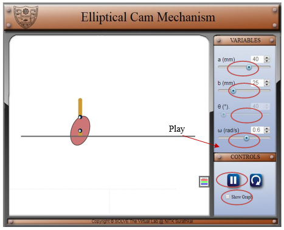
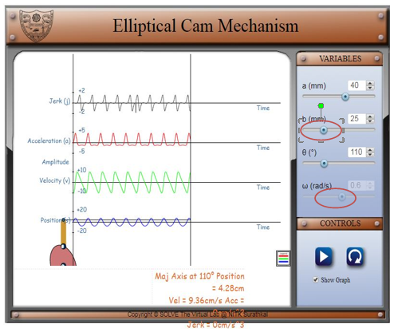

1.  Begin the simulation by clicking on the simulator.
2.  Adjust the angular speed (ω), major (a) and minor (b) axis accordingly and click on play.

3.  Observe the change in position, velocity, acceleration and jerk received by the follower by clicking on show graph.
4.  The numerical values of position, velocity, acceleration and jerk in are obtained by by clicking on pause button and by scrolling the θ according to the requirement.

