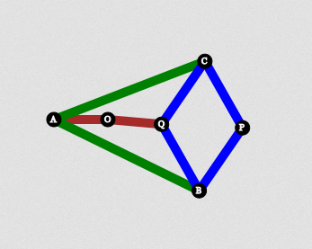

Peaucellier-Lipkin linkage was the first true planar straight line mechanism. It can draw a perfect straight line. Peaucellier Mechanism consists of 8 links.

BPCQ in the figure forms a rhombus. AB=AC and AO=OQ. Point P traces a straight line path.
