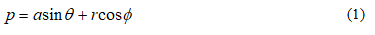
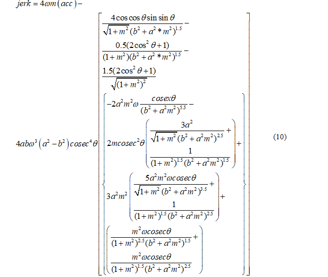

## Learning objectives

After completing the simulation experiment on eccentric and elliptical cam one should be able to:

- To understand the position, velocity, acceleration and jerk of a cam with respect to time.
- To observe the effect of change in radius, eccentricity, angular position and speed on the position, velocity, acceleration and jerk of the follower.

## Introduction

Cams are mechanical devices, used to generate the curvilinear or irregular motion of mechanical elements. Cams convert rotary motion into oscillatory motion or oscillatory motion into rotary motion. In general, cams have three elements, namely; cam, follower and the frame. The cam acts as an input member and the follower functions as an output member. The frame supports the cam and guides the follower. Transmission of motion from the cam to the follower is achieved by direct contact, where the rotation motion is converted into the translation motion. The cams are more advantageous in producing complicated output motions, which are otherwise difficult to achieve.

**Classification of Cams:** 
The cams are classified based on the profile and its contour. The basic classification include,

**Wedge and Flat Cams:** 
The cams are classified based on the profile and its contour. The basic classification include,

A typical arrangement of wedge cam is shown in Figure 1a. A wedge cam has a wedge of specified contour and a follower. The follower can either translate or oscillate based on the translation motion of the cam. A spring is used to maintain the constant contact between the cam and the follower.

**Plate Cam:** 
The plate(or disc) cam (Figure 1b) is a flat disc with an irregular contour to impart a specific motion to the follower. The follower moves in a plane normal to the axis of rotation of the camshaft and is held in contact with the cam by springs or gravity. As the cam is rotates, its profile translates into a particular movement of the follower usually up and down. Plate cams are very popular due to their simplicity and compactness.

**Cylindrical Cam:** 
Cylindrical cam (Figure 1c) comprises of a groove cut on its outer periphery. The roller follower operates in a groove may translate or oscillate.

Figure 1: Types of cam (a) Wedge cam, (b) Plate cam (c) Cylindrical cam

[Courtesy: http://nptel.ac.in/courses/112103174/module4/lec3/1.html]

**Cam Nomenclature:** 
The nomenclature of a Cam is illustrated Figure 2.

Figure 2: Cam nomenclature

[Courtesy: https://www.cs.cmu.edu/~rapidproto/mechanisms/chpt6.htm]

**Trace Point:**
A theoretical point on the follower, corresponding to a fictitious knife-edge follower. It is used to generate the pitch curve. For a roller follower, the trace point is at the centre of the roller.

**Pitch Curve:**
The path generated by the trace point as the follower rotates about a stationary cam.

**Working Curve:**
The working surface of a cam in contact with the follower. For the knife-edge follower of the plate cam, the pitch curve and the working curves coincide.

**Pitch Circle:**
A circle from the cam centre through the pitch point. The pitch circle radius is used to calculate the minimum size a cam for a given pressure angle.

**Prime Circle (reference circle):**
The smallest circle from the cam centre through the pitch curve.

**Base Circle:**
The smallest circle from the cam centre through the cam profile curve.

**Stroke or Throw:**
The greatest distance or angle through which the follower moves or rotates.

**Follower Displacement:**
The position of the follower from a specific zero or rest position (usually its the position when the follower contacts with the base circle of the cam) in relation to time or the rotary angle of the cam.

**Pressure Angle:**
The angle at any point between the normal to the pitch curve and the instantaneous direction of the follower motion. This angle is important in cam design because it represents the steepness of the cam profile.

**Motion Events:** 
During the motion of a cam for one complete cycle, the follower executes a series of events consisting of rises, dwells and returns (Figure 3). Rise is the motion of the follower away from the cam centre, dwell is the motion during which the follower is at rest and return is the motion of the follower toward the cam centre.

Figure 3: Cam motion cycle

[Courtesy:https://en.wikipedia.org/wiki/Cam#/media/File:Basic_Displacement_Diagram.JPG]

**Applications of Cam:** 
Cams are widely used in automation of a machinery, gear cutting machines, screw machines, printing press, textile industries, automobile engine valves, tool changers of machine centres, conveyors, pallet changers, sliding fork in warehouses, etc.

**Cams in Automobile:** 
Cams are also used in I.C engines to operate the inlet valves and exhaust valves. The cam shaft rotates by using prime movers. It causes the rotation of cam. This rotation produces translatory motion of tappet against the spring (Figure 4). This translatory motion is used to open or close the valve.

Figure 4: Application of cam in an automobile

[Courtesy:https://www.howacarworks.com]

**Cams in Automatic Lathes:** 
The cam shaft is driven by a motor. The cutting tool mounted on the transverse slide travels to desired depth and at desired feed rate by a set of plate cams mounted on the cam shaft. The bar feeding through headstock at desired feed rate is carried out by a set of plate cams mounted on the camshaft.

**Automatic Copying Machine:**

Figure 5: Automatic copying of cam profile

[Courtesy:http://nptel.ac.in/courses/112103174/module4/lec3/4.html]

The cam profile can be transferred onto the work piece by using a roller follower as shown in Figure 5. The follower can be mounted with a cutting tool. As the cam traverses, the roller follows the cam profile. The required feature can be copied onto the work piece by the movement of follower over the cam profile.

**Velocity and Acceleration Analysis:**

**Eccentric Cam:**
An eccentric cam (Figure 6 ) is a disc with its centre of rotation positioned off centre. This means as the cam rotates the flat follower rises and falls at a constant rate. This type of cam is the easiest to make, and yet it is one of the most useful. It is most often employed in steam engines and used to convert rotary into linear reciprocating motion in order to drive a sliding valve or a pump ram.

Figure 6: An illustration of an Eccentric cam

An eccentric cam usually has a groove at its circumference around which is closely fitted a circular collar (eccentric strap) attached an eccentric rod. The rod is suspended in such a way that its other end can impart the required reciprocating motion.

**Velocity, Acceleration and Jerk in an Eccentric Cam:** 
A detailed mathematical formulation to derive the velocity, acceleration and jerk in a eccentric cam is discussed below. 
A schematic representation of an eccentric cam is show in Figure 7. 
Let, 
a = eccentricity 
r = radius of circular cam 
θ = angular position of cam 
θ = angular position of eccentric cam with respect to normal 
ω = angular velocity of the cam (assumed to be constant)br> 
With respect to the Figure 7, the position of the follower of the elliptical cam is given by:

Figure 7: Schematic representation of an eccentric cam

Position p in an eccentric cam is given by,

where,

The velocity of reciprocation v, of the follower is the derivative of position p and is given by:

The acceleration of the follower acc, is also a derivative of velocity and it written as,

The jerk is rate of change of acceleration and it is given by:

**Elliptical Cam:** 
Elliptical cam is a special type of cam which is used for sudden increment in position, velocity, acceleration, or jerk is the elliptical cam. These parameters are dependent on the major and minor axis of the cam. Larger the difference between the major and minor axis of the elliptical cam, higher will be the velocity, acceleration and jerk received by the follower. It is worth noting that, if the major and minor axis of cam becomes equal, the profile of cam becomes circular then the lift of the follower will be zero.

**Velocity, Acceleration and Jerk in an Elliptical Cam:** 
A schematic representation of an eccentric cam is shown in Figure 8.

The position p of the follower of the elliptical cam is given by,

where, a is the semi-major axis of the ellipse, b = semi-minor axis of the ellipse θ¸ = angle made by the semi-major axis with the horizontal m= slope of the major axis ω = angular velocity of the cam (assumed to be constant) 
The slope of the major axis with respect to the vertical is:

The velocity of reciprocation of the follower is the first derivative of the position, which is given by,

The velocity of reciprocation of the follower is the first derivative of the position, which is given by,

The jerk experienced by the follower is the derivative of the acceleration and is given by,

